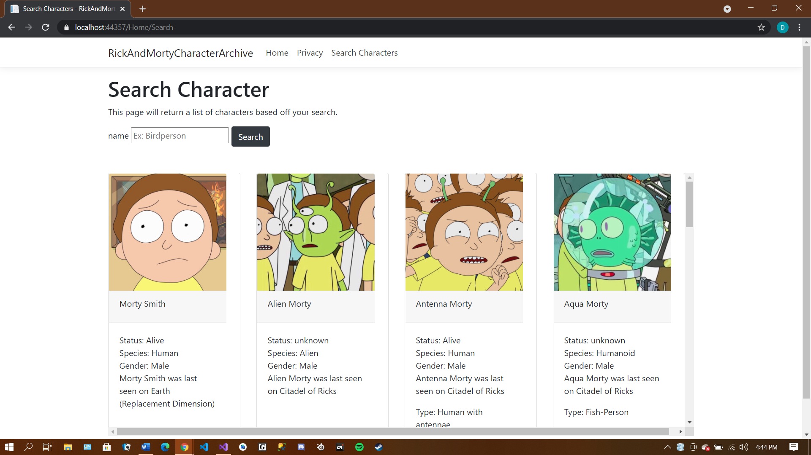

# RickAndMortyCharacterArchive

### Purpose

This project is just a fun little website for Rick and Morty fans like myself that allows
you to dive into thier world and get updated information on the characters and locations.

### Using the Project

The only thing that you need to download for the project if you want to use the Api is to download the
RickAndMorty NuGet package by:
1. Open your package manager console.
2. Enter "Install-Package RickAndMorty.Net.Api" in the console.
3. You can refer to the [Readme](https://github.com/Carlj28/RickAndMorty.Net.Api) of the .net Api repo for instructions on usage.

### Information on API
The documentation for this API can be found at this [site](https://rickandmortyapi.com/).
